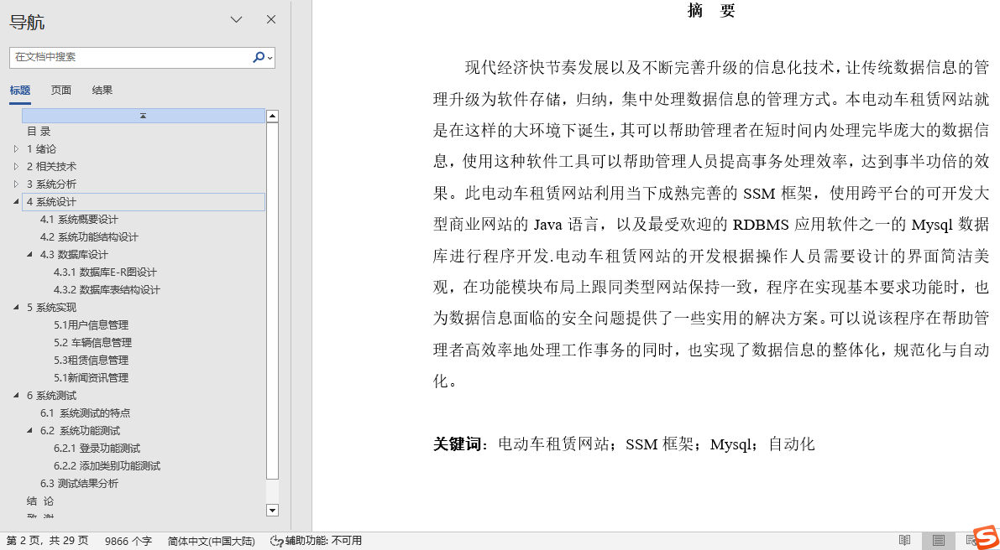
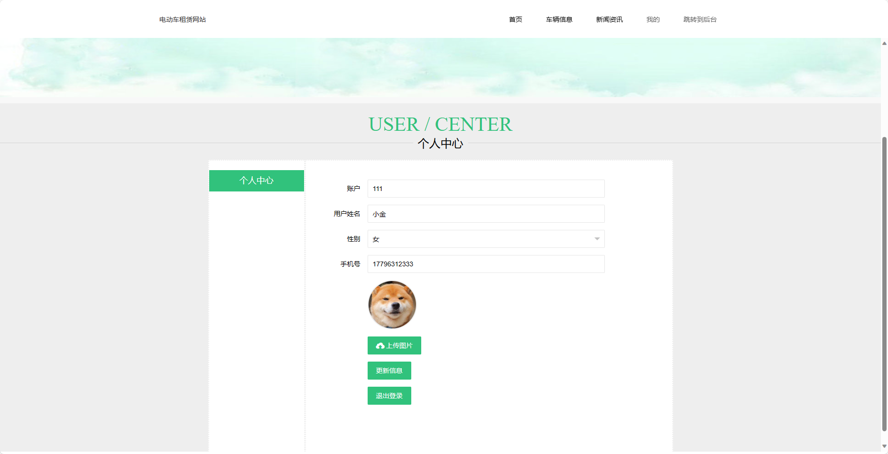
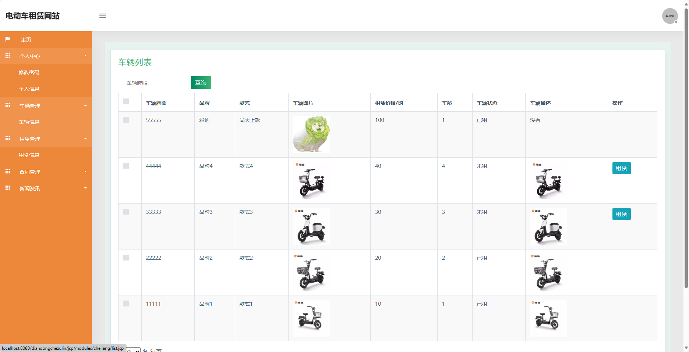
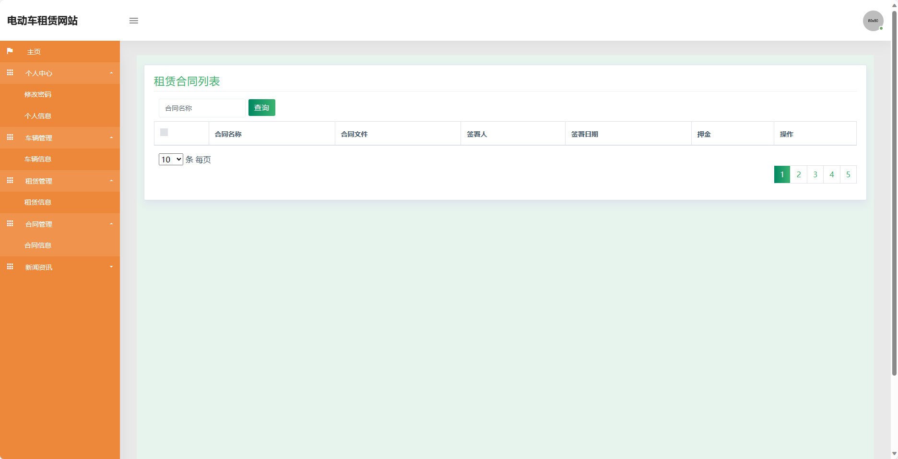
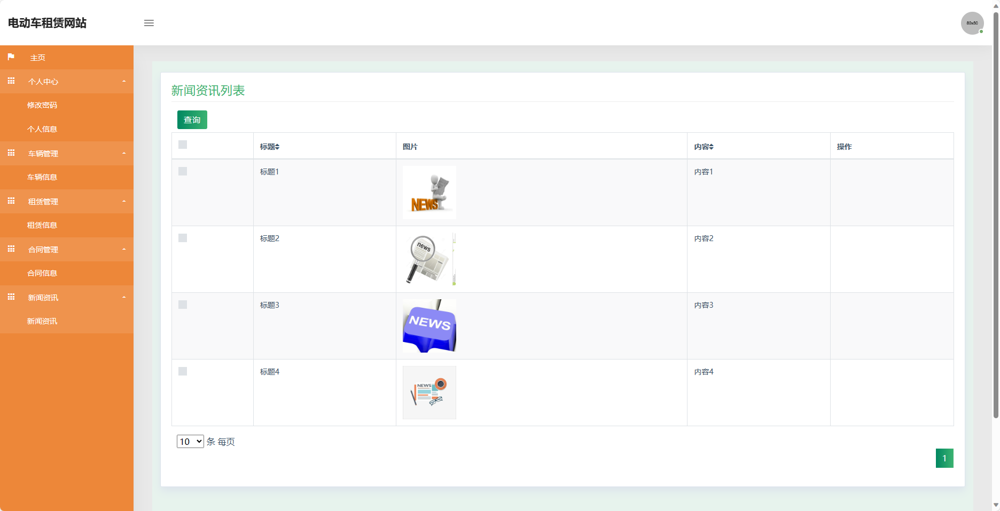
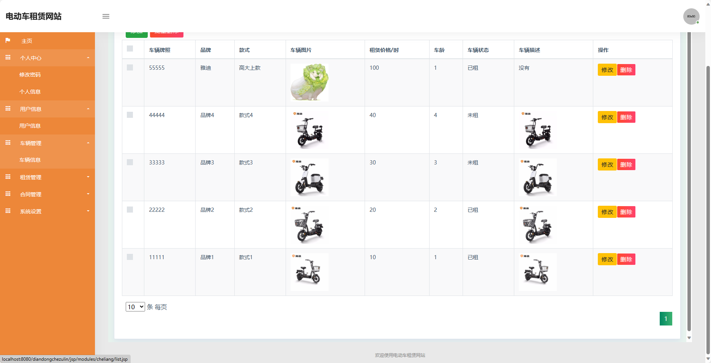
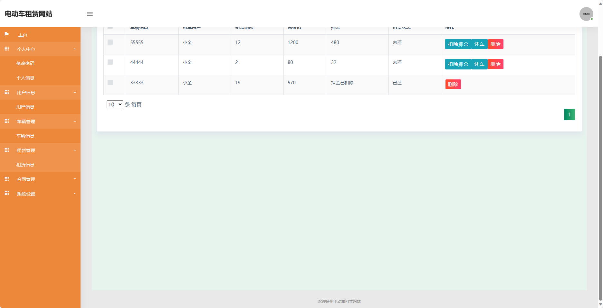
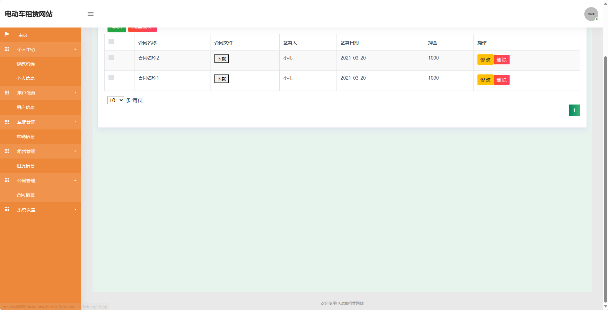

## 基于SSM框架实现的电动车租赁网站(程序+报告)

###  获取sql数据库文件: 从戎源码网 (https://armycodes.com/) QQ: 386869957 QQ群: 377586148
###  所有系统地址: (https://github.com/YuLin-Coder/AllProjectCatalog) 
###  所有项目以及源代码本人均调试运行无问题 可支持远程安装部署调试、定制修改、代码讲解

## 项目介绍
基于SSM框架实现的电动车租赁网站，系统包含两种角色：管理员、用户,系统分为前台和后台两大模块，主要功能如下。

前台-【用户】：
1. 首页：展示网站的基本信息和推荐车辆，提供快捷入口和搜索功能，方便用户浏览和选择。
2. 车辆信息：用户可以查看各种类型的电动车信息，包括车型、图片、价格、租赁时长等，还可以查看车辆的详细介绍和用户评价。
3. 新闻资讯：用户可以浏览最新的电动车行业资讯和活动信息，包括新车发布、促销活动、行业动态等，方便用户了解最新的行业动态。
4. 我的：用户可以登录或注册账号，查看个人信息和订单记录，还可以进行充值、租赁、还车等操作，方便用户管理个人信息和租赁记录。

后台-【管理员】：
1. 个人中心：管理员可以查看和管理个人信息，包括用户名、手机号码、员工编号等，还可以修改密码和联系方式。
2. 用户信息：管理员可以管理用户信息，包括查看用户列表、编辑用户信息、冻结用户账号等，还可以查看用户的订单记录和充值记录。
3. 车辆管理：管理员可以管理车辆信息，包括添加、编辑和删除车辆，设置车辆的基本信息和价格，还可以查看车辆的租赁记录和评价。
4. 租赁管理：管理员可以管理租赁订单，包括查看订单列表、审核订单、取消订单等，还可以统计租赁情况和生成报表。
5. 合同管理：管理员可以管理租赁合同，包括查看合同列表、生成合同、终止合同等，还可以管理合同的签约和归档。
6. 新闻资讯：管理员可以管理网站的新闻资讯，包括添加、编辑和删除资讯，设置资讯的发布时间和推荐位，还可以查看资讯的浏览量和评论。
7. 系统设置：管理员可以管理系统的基本设置，包括设置轮播图和广告位，还可以配置网站的基本信息和SEO优化。

## 项目技术
- 编程语言：Java
- 数据库：MySQL
- 前端技术：JSP、HTML、Jquery、Bootstrap
- 后端技术：Spring、SpringMVC、MyBatis

## 运行环境
- JDK版本：JDK1.8及以上
- 开发工具：IDEA、Ecplise、Myecplise都可以
- 数据库: MySQL5.7及以上

## 运行截图

